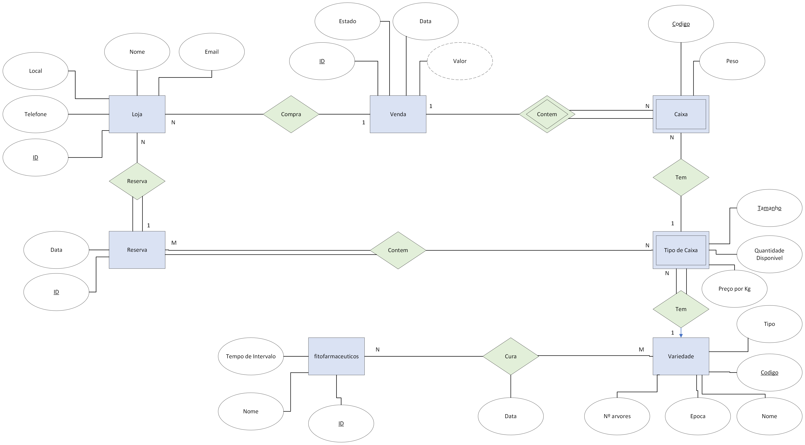
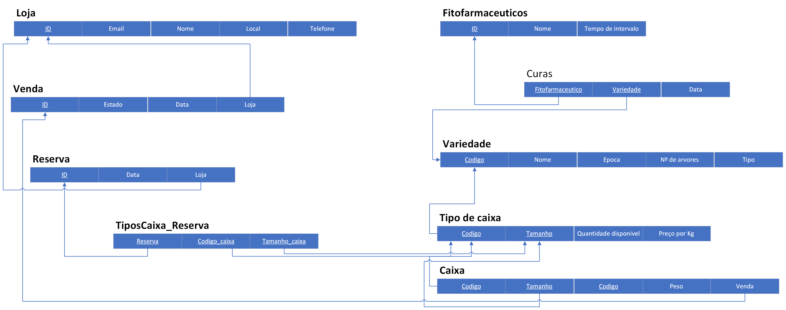

# BD-peach-project

**Grupo**: P5G7
- Gabriel Teixeira, MEC: 107876
- Tomás Victal, MEC: 109018

## Introdução / Introduction
 
O objetivo da base de dados é gerir o fornecimento de pessegos para revenda em lojas locais. Isto inclui um regsito das lojas, as vendas e reservas associadas as lojas e possibilidade de gerir a disponibilidade da fruta. 

## ​Análise de Requisitos / Requirements

O sistema tem de gerir vendas e reservas para as lojas locais e o estado do produto.
A loja é defenida pelo o seu ID, e contem Nome, Telefone, Email e Local.
A loja pode fazer Reservas dos tipos de caixa que deseja comprar.
Esta reserva terá uma data e identifacador unico.
Será registado as vendas feitas a todas as lojas cada venda tem o seu identiacador unico, Estado (pago ou credito), valor, as Caixas vendidas, o valor total e a data da venda.

É necessario gerir as variadades de pessegos existentes, para cada variadade existem 3 tipos de caixas (em que os tamnhos dos pessegos difere), pequenos,medios,grandes.
As variadades serao defenidas por Codigo, Nome, Epoca,Nº arvores.
O tipo de caixa tera uma variedade, tamanho (pessego), uma aproximaçao da quantidade de caixas disponiveis e preço por Kg

Nas vendas cada caixa terá um tipo de caixa Codigo e o Peso.


## DER




## ER




## Algebra Relacional:

- lista de vendas

- lista de vendas que ainda nao foram pagas

- lista das lojas na base de dados

- as caixas de uma venda de uma loja bem como a sua variedade e tamanho

- obter reservas e o nome das lojas que fizeram para uma data

- obter o nome da loja e os tipos de caixas reservados e sua quantidade de uma reserva

- obter caixas que nao estao sobre regime de espera devido ao uso de fitofarmaceuticos

- obter caixas que estao sobre regime de espera devido ao uso de fitofarmaceuticos

- obter curas aplicadas numa data, numa variedade

- obeter epoca dos tipos de caixa

- obter os fitofarmaceutiocos usados nos tipos de caixa

- obter fitofarmaceuticos ainda nao usados

- obeter quatidade vendidada de cada tipo de caixa

- obeter n de vendas para cada loja

- obeter n de reservas de cada loja

## Stored Procedure

### Login Procedure
```SQL
CREATE PROCEDURE [loginP] (@username VARCHAR(20),@password VARCHAR(64),@store INT OUTPUT,@IsAdm BIT OUTPUT)
AS
	SELECT @store = store
	FROM [LOGIN]
	WHERE username = @username AND [password] = @password

	IF @store IS NULL
		SET @IsAdm = 1
	ELSE
		SET @IsAdm = 0

CREATE PROC getStores
AS

Select * from LOJA
```
## Extras

### Dados 

- lojas sao reais exepeto nif e email

- variriedades tambem contem valores reais