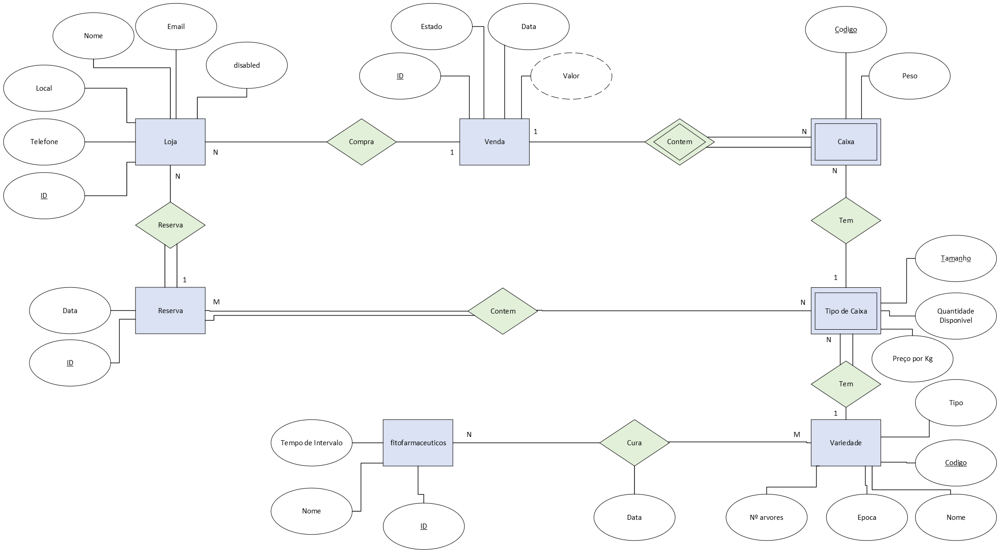
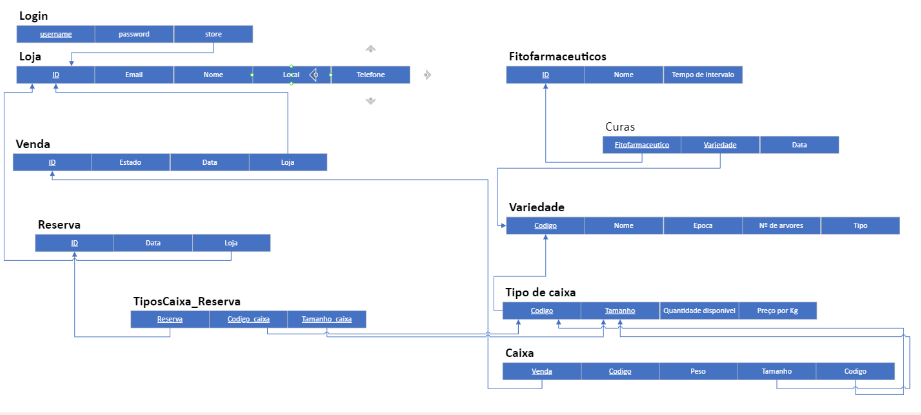
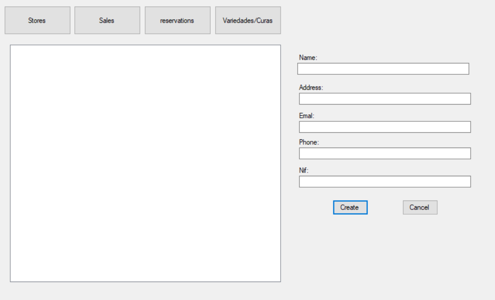
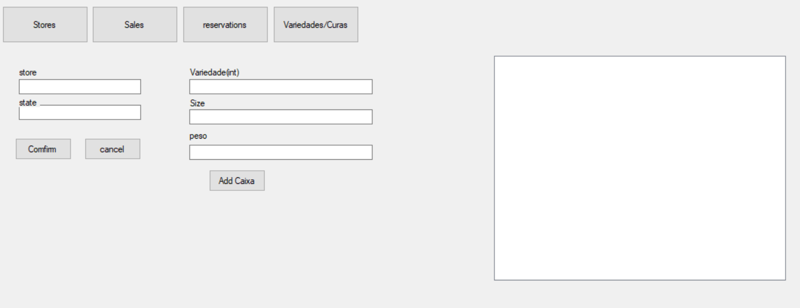

# BD: Trabalho Prático APF-T

**Grupo**: PXGY
- Tómas Victal, MEC: 109018 
- Gabriel Teixeira , MEC: 107876

## Introdução / Introduction

    A base de dados tem como finalidade gerenciar o fornecimento de pêssegos para revenda em lojas locais, oferecendo um registro completo das lojas, vendas e reservas associadas, além da possibilidade de gerir a disponibilidade da fruta. Com isso, a empresa poderá controlar de forma eficiente as vendas, reservas e estoques, bem como planejar a produção e a distribuição dos pêssegos de forma estratégica, garantindo a satisfação dos clientes e a maximização dos lucros. A base de dados permitirá ainda a geração de relatórios e estatísticas precisas, auxiliando na tomada de decisões fundamentais para o sucesso do negócio.

## ​Análise de Requisitos / Requirements

    O sistema tem de gerir vendas e reservas para as lojas locais e o estado do produto. A loja é defenida pelo o seu ID, e contem Nome, Telefone, Email e Local. A loja pode fazer Reservas dos tipos de caixa que deseja comprar. Esta reserva terá uma data e identifacador unico. Será registado as vendas feitas a todas as lojas cada venda tem o seu identiacador unico, Estado (pago ou credito), valor, as Caixas vendidas, o valor total e a data da venda.

    É necessario gerir as variadades de pessegos existentes, para cada variadade existem 3 tipos de caixas (em que os tamnhos dos pessegos difere), pequenos,medios,grandes. As variadades serao defenidas por Codigo, Nome, Epoca,Nº arvores. O tipo de caixa tera uma variedade, tamanho (pessego), uma aproximaçao da quantidade de caixas disponiveis e preço por Kg

    Nas vendas cada caixa terá um tipo de caixa Codigo e o Peso.

# Entidades

## Loja

- A loja pode fazer Reservas dos tipos de caixa que deseja comprar.
- A loja é definida pelo o seu ID, e contém Nome, Telefone, Email e Local.

## Reserva

- Esta reserva terá uma data e identificador único.Será registado as vendas feitas a todas as lojas cada venda tem o seu identificador único, Estado (pago ou crédito), valor, as Caixas vendidas, o valor total e a data da venda.

## Venda

- Nas vendas de cada caixa.

## Caixa 

- Cada caixa terá um tipo de caixa Código e o Peso.

## Tipo de Caixa 
- O tipo de caixa terá uma variedade, tamanho (pêssego), uma aproximação da quantidade de caixas disponíveis e preço por Kg.

## Variedade
- É necessário gerir as variedades de pêssegos existentes, para cada variedade existem 3 tipos de caixas (em que os tamanhos dos pêssegos difere), pequenos,médios,grandes.As variedades serão definidas por Código, Nome, Epoca,Nº árvores.

## Fitofarmacêuticos 
- substâncias químicas utilizadas na agricultura para controlar pragas, doenças e ervas daninhas, visando proteger as plantas e garantir a produção agrícola. 

# DER - Diagrama Entidade Relacionamento/Entity Relationship Diagram

### Versão final/Final version



## APFE 

Adicionamentos de atributos e entidades ao DER inicial:

Foi implementado na entidade Loja um atributo Disabel que consisti-te em que a Loja pode estar disponievel ou não para cada Loja. 
E no diagrama de ER decisomos inpllmentar a entidade Login que consistia 

## ER - Esquema Relacional/Relational Schema

### Versão final/Final Version



### APFE

Adicionamentos de atributos e entidades ao ER inicial:

Foi implementado a Entidade Login com as informacoes de usermane, password, ,store em que pelo menos o nome do user tem que ser difierente para realizar o seu login.

## ​SQL DDL - Data Definition Language

[SQL DDL File](./Create_DataBase.sql)

## SQL DML - Data Manipulation Language


### Formulario exemplo/Example Form
### Criação de uma loja 


```sql

CREATE PROC addStore (@email VARCHAR(64) = NULL,@name VARCHAR(64),@address VARCHAR(64),@phone VARCHAR(9),@nif INT = NULL)
AS
INSERT INTO LOJA (email, [name], [address], phone, nif) VALUES
(@email,@name,@address,@phone,@nif)
go


```

## Comfirmar venda

```sql
CREATE PROC addToVenda(@sale INT,@weigth DECIMAL(4,2),@code INT,@size VARCHAR(6))
AS
INSERT INTO CAIXA(sale,[weight],code,size) VALUES
	(@sale,@weigth,@code,@size);
go
```


...

## Normalização/Normalization

Os passos que usamos para minimizar a duplicação de dados e a sua redução de espaço:
- a ulizadarvaas de vairas tableas isto é a interligacao dessa, como por exmeplos a ligacoa das entidaddes loja caixa , tipo de caixa e varidade
- a utilização de algumas funções como por exemplo a GetSGBDConnection() que conceta a base de dados 


## Índices/Indexes

```sql

CREATE PROC addToVenda(@sale INT,@weigth DECIMAL(4,2),@code INT,@size VARCHAR(6))
AS
INSERT INTO CAIXA(sale,[weight],code,size) VALUES
	(@sale,@weigth,@code,@size);
go


```
A Stored Procedure "addToVenda" serve para adicionar um novo registro à tabela "CAIXA" em um sistema de vendas, especificos para "sale", "weight", "code" e "size". Essa Stored Procedure é usada quando há a necessidade de registrar informações sobre vendas em caixas.
## Seguranca/Security

De modo a tentar minimizar possíveis vulnerabilidades da base de dados a ataques
de SQL Injection. De modo a prevenir estes problemas, na implementação da base de dados
foram tidos em conta os seguintes pontos:
- Verificações dos dados inseridos pelos utilizadores, (através de triggers)
- Tentamos ao máximo utilizar SQL Parametrizado ou Stored Procedures , em
vez de recorrermos ao SQL Dinâmico.
- São apresentadas mensagens de erro, ao utilizador de modo a que este
perceba que introduzir valores ou informações erradas.


## SQL Programming: Stored Procedures, Triggers, UDF

[SQL SPs and Functions File](./UDF.sql )
### Exemplos de Triggers

 - Adicionar index para store 
 - Adicionar index para name e nif

```sql

meter aqui o codigo

```


### Exemplo de uma UDF

```sql
DROP FUNCTION IF EXISTS getVariedadesComCuraAplicada
go
CREATE FUNCTION getVariedadesComCuraAplicada() RETURNS @table TABLE (variedades INT)
AS
BEGIN
DECLARE @now  DATETIME = GETDATE();
INSERT @table
	SELECT V.code
	FROM VARIEDADE AS V JOIN CURAS AS C on V.code  = C.variety JOIN FITOFARMACEUTICOS on FITOFARMACEUTICOS.id = C.fitofarmaceutic
	WHERE DATEDIFF(HOUR,C.dateH,@now) < FITOFARMACEUTICOS.interval_days*24
RETURN;
END

```
A Stored Procedure "getVariedadesComCuraAplicada" serve para obter as variedades que têm cura aplicada. Essa Stored Procedure é usada quando há a necessidade de obter as variedades que têm cura aplicada.


[SQL Triggers File](sql/03_triggers.sql "SQLFileQuestion")

## Conclusão/Conclusion
Sendo neste ponto notório que a base de dados se encontra em funcionamento,
podemos considerar que a mesma foi implementada.
Com a implementação da interface gráfica, conseguimos de uma maneira visual e
apelativa ver toda a estrutura a funcionar corretamente, sendo então concretizado o
objetivo inicial de uma implementação correta de um sistema de gestão de pêssegos.

## Outras notas/Other notes

### Dados iniciais da dabase de dados/Database init data

[Indexes File](sql/01_ddl.sql "SQLFileQuestion")


 